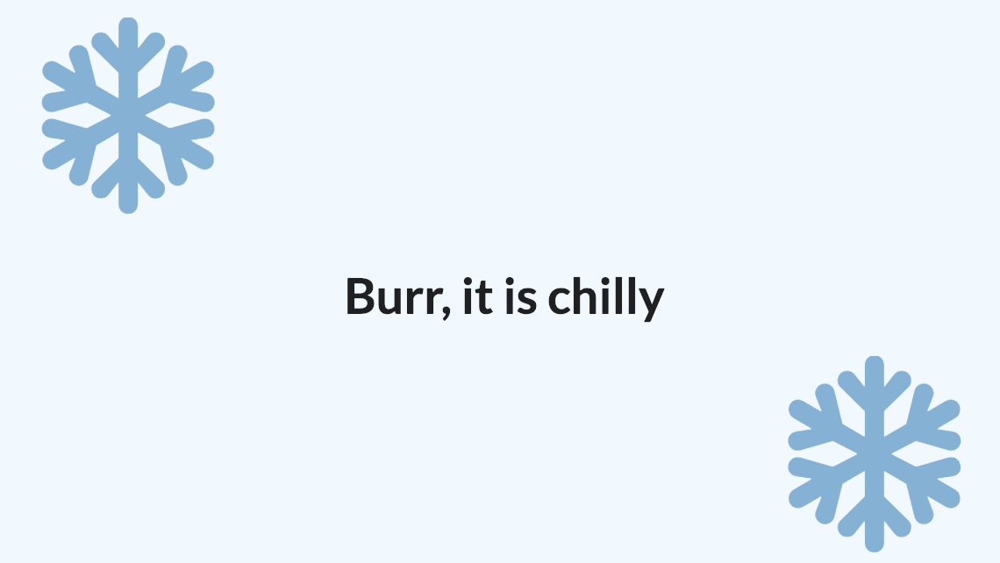
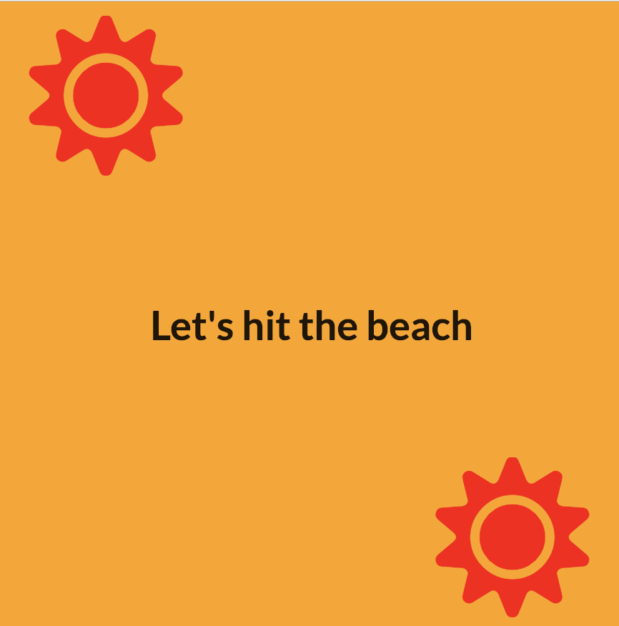

### Technologies use to build this page:
- HTML
- CSS
- Javascript
- semantic-ui
- ReactJS
  - Lifecycle of methods
  - passing state as props
  - class based component
  - updating components with states
  - CSS Styling

### Desciption
This app uses the browser geolocation to determine if the user is in northern or southern hemisphere. Then the app displays a page appropriately. The app makes use of the state property and componentDidMount.

### Final Result:

 
 

